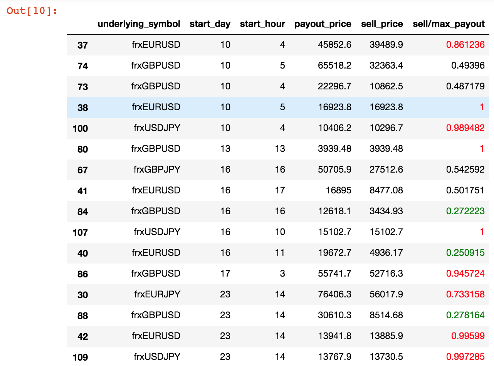

# Purpose
This workflow extracts all users who have ever used a browser with the language set to `ZH_CN` or `TW_CN`, and then extracts all their contracts (excluding those on volatility indices). We then describe a way of identifying times of interest when there were disproportionately many winning or losing contracts.

## Extract all logins with a browser set to `ZH_CN` or `TW_CN`
Use the following PostgreSQL query on `reportdb` or its replica:
```
WITH buid AS (
  SELECT * FROM betonmarkets.production_servers_v2() as ps
  CROSS JOIN dblink(ps.srvname, $$
    SELECT loginid, binary_user_id FROM betonmarkets.client;
  $$) out(loginid TEXT, binary_user_id BIGINT)
) SELECT ulh.id, ulh.history_date, ulh.environment, buid.loginid, buid.binary_user_id
FROM users.login_history AS ulh JOIN buid ON buid.binary_user_id = ulh.binary_user_id
WHERE ((environment like '%LANG=ZH_CN') or (environment like '%LANG=TW_CN'))
ORDER BY history_date DESC;
```
The output of this query is a list of all logins where the browser language was `ZH_CN` or `TW_CN`.

From the output we can either extract the set of users with this property or do analysis on this subset of login data itself.

To extract the set of unique `loginid` (i.e., after discarding the duplicates), we can just do a further `groupby` on `loginid`. **Let's assume that we have done so and extracted the set of unique `loginid` as a comma-separated list `L`.**

## Extract all contracts purchased by a specified set of users
Use the following PostgreSQL query on `reportdb` or its replica:
```
with params as (select
       '2018-07-01'::TIMESTAMP AS start_date,
       '2018-07-31'::TIMESTAMP AS end_date
)   
select output.*
from params
CROSS JOIN betonmarkets.production_servers_v2() as ps
CROSS JOIN dblink(ps.srvname,
$$
     select b.id, 
            b.purchase_time, 
            b.underlying_symbol, 
            b.payout_price, 
            b.buy_price, 
            b.sell_price, 
            b.start_time,
            b.expiry_time, 
            b.bet_type, 
            b.remark, 
            b.short_code, 
            b.sell_time, 
            a.client_loginid, 
            bm.market, 
            bm.submarket, 
            data_collection.exchangetousd_rate(a.currency_code, b.purchase_time) as "exchange_rate",
            c.residence
     from bet.financial_market_bet as b
     join transaction.transaction t on b.id=t.financial_market_bet_id and t.action_type='sell'
     join transaction.account a on a.id=b.account_id
     join betonmarkets.client c on c.loginid=a.client_loginid
     left join bet.market bm on b.underlying_symbol = bm.symbol
     where market <> 'volidx' and
      sell_time is not null and
     ((purchase_time between $$ || quote_literal(params.start_date) || $$::TIMESTAMP and $$ || quote_literal(params.end_date) || $$::TIMESTAMP) or
           (sell_time between $$ || quote_literal(params.start_date) || $$::TIMESTAMP and $$ || quote_literal(params.end_date) || $$::TIMESTAMP))
$$) as output(id NUMERIC, 
        purchase_time TIMESTAMP, 
        underlying_symbol VARCHAR, 
        payout_price NUMERIC, 
        buy_price NUMERIC, 
        sell_price NUMERIC, 
        start_time TIMESTAMP, 
        expiry_time TIMESTAMP, 
        bet_type VARCHAR,
        remark VARCHAR, 
        short_code VARCHAR, 
        sell_time TIMESTAMP, 
        client_loginid VARCHAR,
        market VARCHAR,
        submarket VARCHAR,
        exchange_rate NUMERIC,
        residence VARCHAR)
where output.client_loginid in ('CR106163', ..., 'MX43167')
```
In particular, we can replace `('CR106163', ..., 'MX43167')` with `L` (from the previous section).

## Identify times of significant trading in a selected set of contracts and highlight disproportionate wins and losses
The following code assume that an appropriate set of contracts is available as a `CSV` file. For example, we can collect the set of contracts that were purchased by users who had ever logged in using a browser whose language was set to `ZH_CN` or `TW_CN`.

```
import pandas as pd

def color_outliers(v):
    """
    Takes a scalar and returns a string with
    the css property `'color: red'` for those values that
    exceed 0.55, `'color: green'` for those values that
    are below 0.45, and `'color: black'` otherwise.
    """
    try:
        val = float(v)
    except:
        val = 0.5
    if val > 0.55:
        color = 'red' 
    elif val < 0.45:
        color = 'green' 
    else:
        color = 'black'
    return 'color: %s' % color

df = pd.read_csv('contracts.csv')
df.sort_values(by=['purchase_time'], inplace=True)
df['start'] = pd.to_datetime(df['start_time'])
df['end'] = pd.to_datetime(df['expiry_time'])
df['duration'] = df['end']-df['start']
df['duration'] = [pd.Timedelta.total_seconds(x) for x in df['duration']]
df['start_hour'] = df['start'].dt.hour
df['start_day'] = df['start'].dt.day
df2 = df.groupby(['underlying_symbol','start_day','start_hour'])[['payout_price', 'sell_price']].sum()
df2.reset_index(inplace=True)
df2 = df2.sort_values(by=['start_day', 'start_hour'], ascending=True, inplace=False)[[
    'underlying_symbol', 'start_day', 'start_hour','payout_price', 'sell_price']]
df2['sell/max_payout'] = df2['sell_price']/df2['payout_price']
significance_mask = (df2['payout_price']>999)
df3 = df2[significance_mask].style.applymap(color_outliers, subset=['sell/max_payout'])
df3 # displays the outcomes
```
Here's an example output screengrab:
 
